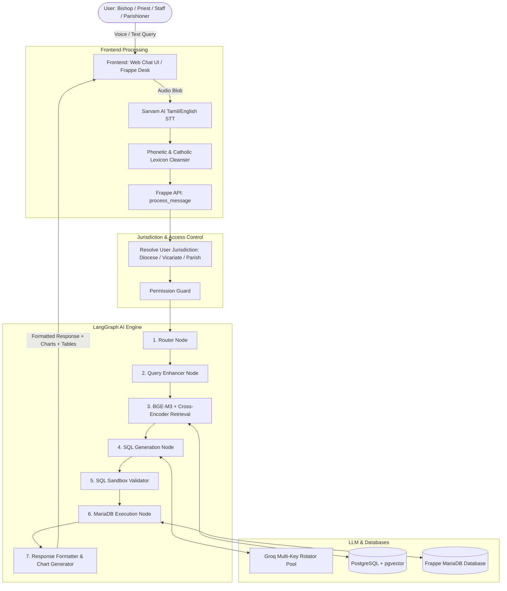
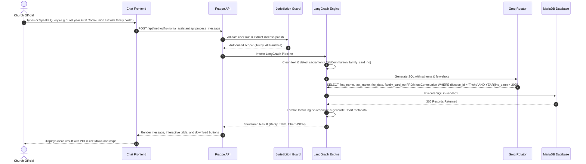

# ⛪ KOINONIA Assistant — Comprehensive Project Documentation

---

## 📑 Table of Contents
1. [Executive Summary & Project Objectives](#1-executive-summary--project-objectives)
2. [High-Level System Architecture](#2-high-level-system-architecture)
3. [Component Breakdown](#3-component-breakdown)
   * [3.1 Web Client & User Interface (UI Layer)](#31-web-client--user-interface-ui-layer)
   * [3.2 Multilingual Speech & Phonetic Processing Engine](#32-multilingual-speech--phonetic-processing-engine)
   * [3.3 Hybrid RAG & AI Reasoning Pipeline (LangGraph)](#33-hybrid-rag--ai-reasoning-pipeline-langgraph)
   * [3.4 Groq Multi-Key Rotator & LLM Orchestration](#34-groq-multi-key-rotator--llm-orchestration)
   * [3.5 Ecclesiastical Jurisdictional Access Guard (Security Layer)](#35-ecclesiastical-jurisdictional-access-guard-security-layer)
   * [3.6 Database Models (11 Core Custom DocTypes)](#36-database-models-11-core-custom-doctypes)
   * [3.7 PostgreSQL Vector Database (`pgvector`)](#37-postgresql-vector-database-pgvector)
4. [LangGraph Execution Workflow](#4-langgraph-execution-workflow)
5. [Ecclesiastical Role & Permission Matrix](#5-ecclesiastical-role--permission-matrix)
6. [Multilingual & Phonetic Speech Dictionary](#6-multilingual--phonetic-speech-dictionary)
7. [API Endpoints & Frappe Controller Reference](#7-api-endpoints--frappe-controller-reference)
8. [Installation, Docker Deployment & Migration Guide](#8-installation-docker-deployment--migration-guide)
9. [Verification & Benchmark Results](#9-verification--benchmark-results)

---

## 1. Executive Summary & Project Objectives

**KOINONIA Assistant** is a specialized, role-aware Catholic Diocesan & Parish AI Assistant built natively for the **Frappe Framework**. It bridges the gap between historical sacramental records, daily pastoral administration, and natural language AI query processing.

### Key Objectives:
* **Natural Language to SQL**: Enable Bishops, Parish Priests, Curia officials, and Parishioners to query church registries in plain English, pure Tamil (தமிழ்), or Tanglish.
* **Catholic Sacramental Domain Intelligence**: Accurately interpret church terminology (Baptism, Holy Communion, Confirmation, Marriage, Anointing, Burial, Family Cards, Vicariates).
* **Strict Hierarchical Security**: Prevent cross-diocesan and cross-parish data leaks through automatic SQL permission injection and Frappe Desk hooks.
* **Sub-Second Performance**: Execute queries via hybrid vector search (BGE-M3 Dense + Sparse BM25 + Cross-Encoder re-ranking) with Groq LLM failover rotation.
* **Interactive Visualizations & Export**: Dynamically generate Chart.js graphs on demand, with instant PDF and Excel/CSV download capabilities.

---

## 2. High-Level System Architecture



---

## 3. Component Breakdown

### 3.1 Web Client & User Interface (UI Layer)
* **File Locations**:
  * [`koinonia_assistant/www/koinonia_chat.html`](file:///C:/Users/ajaij/.gemini/antigravity/brain/5a92c275-9ea3-485e-b1b8-0f6b9fed07d0/koinonia_assistant/koinonia_assistant/www/koinonia_chat.html)
  * [`koinonia_assistant/koinonia_assistant/page/koinonia_chat/`](file:///C:/Users/ajaij/.gemini/antigravity/brain/5a92c275-9ea3-485e-b1b8-0f6b9fed07d0/koinonia_assistant/koinonia_assistant/koinonia_assistant/page/koinonia_chat/)
* **Features**:
  * **Glassmorphic Catholic Theme**: Custom liturgical accents, cross insignia, role badges, and responsive desktop/mobile layout.
  * **Interactive Voice Visualizer**: Live audio waveform visualization using Web Audio API during speech recording.
  * **Dynamic Chart Rendering**: Automatically converts numerical aggregations into Chart.js Bar, Donut, Pie, or Line charts when requested or when displaying multi-parish metrics.
  * **Tabular Pagination & Search**: Searchable, sortable, client-paginated tables for large sacramental registers.
  * **Registry Report Exports**:
    * **PDF Export**: Generates official `KOINONIA Registry Report` with date, jurisdiction, and summary.
    * **Excel / CSV Export**: Instant table download.

---

### 3.2 Multilingual Speech & Phonetic Processing Engine
* **Integration**: Sarvam AI (`saaras:v1` / `saaras:v2` Speech-to-Text API).
* **Phonetic Normalization**:
  * Resolves acoustic ambiguities common in South Indian church contexts:
    * *"Pudupani"* (`புதுப்பணி`) $\rightarrow$ **"புது நன்மை"** (First Holy Communion)
    * *"Kalyanam"* (`கல்யாணம்`) $\rightarrow$ **"திருமணம்"** (Holy Matrimony)
    * *"Gnanasthanam"* (`ஞானஸ்தானம்`) $\rightarrow$ **"ஞானஸ்நானம்"** (Baptism)
    * *"Family code / Kudumba code"* $\rightarrow$ **`family_card_no`**
    * *"Vicar / Carotts"* $\rightarrow$ **"விகார் / Vicar Forane"**
* **Dual-Display Architecture**:
  * **Chat UI**: Displays the clean Tamil script question to the user.
  * **AI Backend**: Translates to optimized English context for high-precision SQL generation.

---

### 3.3 Hybrid RAG & AI Reasoning Pipeline (LangGraph)
* **File Location**: [`koinonia_assistant/rag/rag_engine.py`](file:///C:/Users/ajaij/.gemini/antigravity/brain/5a92c275-9ea3-485e-b1b8-0f6b9fed07d0/koinonia_assistant/koinonia_assistant/rag/rag_engine.py)
* **Multi-Stage Graph Execution**:
  1. **`router_node`**: Classifies query into `sql_query`, `general_chat`, or `system_help`.
  2. **`enhance_query_node`**: Resolves relative time concepts (*"this year"*, *"last year"*, *"2025"*) and replaces colloquial terms with database column aliases.
  3. **`retrieve_context_node`**: Performs BGE-M3 Dense vector retrieval + Sparse lexical matching on PostgreSQL `pgvector`, followed by Cross-Encoder re-ranking (`ms-marco-MiniLM-L-6-v2`) to extract relevant table schemas and few-shot SQL examples.
  4. **`generate_sql_node`**: Prompts the LLM with strict syntax constraints, schema definitions, and jurisdictional scope.
  5. **`validate_sql_node`**: Validates SQL in a sandbox, stripping destructive commands (`DROP`, `DELETE`, `UPDATE`, `ALTER`, `TRUNCATE`) and enforcing `LIMIT 50`.
  6. **`execute_sql_node`**: Safely executes the query against MariaDB.
  7. **`format_response_node`**: Formats tabular data, builds suggestion chips, and detects if interactive charts should be generated.

---

### 3.4 Groq Multi-Key Rotator & LLM Orchestration
* **Architecture**: Round-robin multi-key pool with automated exponential backoff and dynamic failover.
* **Supported Models**:
  * Primary: `openai/gpt-oss-120b` (Deep text-to-SQL reasoning)
  * Fast Fallback: `qwen/qwen3.6-27b`
  * Backup: `openai/gpt-oss-20b`
* **Features**: Automatic rate-limit (`429`) detection that immediately rotates to the next healthy key in the pool, preventing API throttling.

---

### 3.5 Ecclesiastical Jurisdictional Access Guard (Security Layer)
* **File Location**: [`koinonia_assistant/api.py`](file:///C:/Users/ajaij/.gemini/antigravity/brain/5a92c275-9ea3-485e-b1b8-0f6b9fed07d0/koinonia_assistant/koinonia_assistant/api.py)
* **Hierarchical Enforcement Rules**:
  * **Bishop / Chancellor / Vicar General**: Access limited to their assigned `diocese_id`.
  * **Vicar Forane**: Access limited to parishes within their assigned `vicariate_id`.
  * **Parish Priest / Staff**: Access strictly limited to records where `parish_id = user_parish`.
  * **Parishioner**: Access limited to their personal member records and family card.
* **Double-Layered Protection**:
  1. **AI Chat Guard**: Injects `WHERE diocese_id = '...' AND parish_id = '...'` directly into every generated SQL statement.
  2. **Frappe Desk Hook**: Implements `permission_query_conditions` in `hooks.py` so standard Frappe Desk List and Form views are filtered in real-time.

---

### 3.6 Database Models (11 Core Custom DocTypes)

| DocType | Key Fields | Sacramental / Governance Purpose |
| :--- | :--- | :--- |
| **`Diocese`** | `diocese_name`, `diocese_code`, `bishop_name`, `city` | Diocesan jurisdiction boundaries |
| **`Vicariate`** | `vicariate_name`, `diocese_id`, `vicar_forane` | Deanery / Vicariate grouping of parishes |
| **`Parish`** | `parish_name`, `diocese_id`, `vicariate_id`, `parish_priest` | Parish church directory & priests |
| **`Family`** | `family_code`, `head_of_family_name`, `parish_id`, `anbiyam` | Family register & Basic Christian Communities |
| **`Member`** | `first_name`, `last_name`, `family_card_no`, `gender`, `dob` | Parishioner demographic profile |
| **`Baptism`** | `first_name`, `last_name`, `bapt_date`, `bapt_parish_id`, `family_card_no` | Sacrament of Holy Baptism Register |
| **`Communion`** | `first_name`, `last_name`, `fhc_date`, `fhc_parish_id`, `family_card_no` | First Holy Communion Register |
| **`Confirmation`**| `first_name`, `last_name`, `cnf_date`, `cnf_parish_id`, `cnf_minister` | Sacrament of Confirmation Register |
| **`Marriage`** | `bridegroom_name`, `bride_name`, `mrg_date`, `mrg_parish_id` | Holy Matrimony Register |
| **`Anointing Of Sick`** | `first_name`, `anointing_date`, `parish_id`, `anointing_minister` | Sacrament of the Sick Register |
| **`Death`** | `first_name`, `death_date`, `burial_date`, `parish_id`, `cemetery` | Christian Burial & Death Register |

---

### 3.7 PostgreSQL Vector Database (`pgvector`)
* **Vector Tables**:
  * `koinonia_table_schemas` — Dense vector representations of table definitions.
  * `koinonia_field_schemas` — Field-level vector embeddings for column mapping.
  * `koinonia_few_shots` — Curated ecclesiastical query-to-SQL training examples.
  * `koinonia_query_history` — Audited user query execution history.
* **Embeddings**: BGE-M3 (1024-dimensional dense vectors + sparse lexical weights).

---

## 4. LangGraph Execution Workflow



---

## 5. Ecclesiastical Role & Permission Matrix

| Role | Scope / Jurisdiction | Desk View | Assistant Chat Access | Read / Write |
| :--- | :--- | :--- | :--- | :--- |
| **Bishop** | Entire Assigned Diocese | Full Diocesan Records | All Parishes & Sacraments | Read & Write |
| **Curia / Chancellor** | Entire Assigned Diocese | Full Diocesan Records | All Parishes & Sacraments | Read & Write |
| **Vicar General** | Entire Assigned Diocese | Full Diocesan Records | All Parishes & Sacraments | Read & Write |
| **Vicar Forane** | Assigned Vicariate / Deanery | Deanery Parishes | Vicariate Parishes | Read Only |
| **Parish Priest** | Assigned Parish Only | Assigned Parish Records | Assigned Parish Only | Read & Write |
| **Staff** | Assigned Parish Only | Assigned Parish Records | Assigned Parish Only | Read & Write |
| **Parishioner** | Personal & Family Records | Personal Records | Personal / Family Scope | Read Only |

---

## 6. Multilingual & Phonetic Speech Dictionary

| Spoken / Tanglish Input | Normalized Tamil Ecclesiastical Term | Target Database DocType & Field |
| :--- | :--- | :--- |
| `Pudupani` / `Puthupani` / `புதுப்பணி` | **புது நன்மை** (First Holy Communion) | `tabCommunion` (`fhc_date`) |
| `Kalyanam` / `கல்யாணம்` / `Vivagam` | **திருமணம்** (Holy Matrimony) | `tabMarriage` (`mrg_date`) |
| `Gnanasthanam` / `ஞானஸ்தானம்` | **ஞானஸ்நானம்** (Baptism) | `tabBaptism` (`bapt_date`) |
| `Uruthipoosuthal` / `உறுதிபூசுதல்` | **உறுதிப்பூசுதல்** (Confirmation) | `tabConfirmation` (`cnf_date`) |
| `Noyaligal Poosuthal` / `தைலம்` | **நோயில் பூசுதல்** (Anointing of the Sick) | `tabAnointing Of Sick` (`anointing_date`)|
| `Family Code` / `குடும்ப கோடு` | **குடும்ப அட்டை எண்** | `family_card_no` |
| `Adakkam` / `Maranam` / `இறப்பு` | **அடக்கம் / மரணப் பதிவு** | `tabDeath` (`death_date`) |
| `Vicar` / `Carotts` / `விகார்` | **மறைவட்ட விகார்** | `tabVicariate` (`vicar_forane`) |

---

## 7. API Endpoints & Frappe Controller Reference

### 7.1 Chat Message Processing
* **Endpoint**: `koinonia_assistant.api.process_message`
* **Method**: `POST`
* **Parameters**:
  * `query_text` *(string, required)*: The text or voice-transcribed prompt.
  * `conversation_id` *(string, optional)*: Current chat thread UUID.
  * `language` *(string, optional)*: `'ta'`, `'en'`, or `'auto'`.
* **Sample Response**:
  ```json
  {
    "user_message": "கடந்த வருடம் மொத்தம் எத்தனை பேர் புது நன்மை எடுத்தார்கள் அவர்களின் list மற்றும் family card no-ஐ இரண்டையும் குறிப்பிடவும்",
    "reply": "உங்கள் தேடலுக்கு ஏற்ப **306** பதிவுகள் கண்டறியப்பட்டன:",
    "data": [
      {"full_name": "Cosmas Maria K.", "family_card_no": "FC-17912"},
      {"full_name": "Ignatius Siluvairaj S.", "family_card_no": "FC-29620"}
    ],
    "generated_sql": "SELECT first_name, middle_name, last_name, family_card_no FROM tabCommunion WHERE diocese_id = 'Trichy' AND YEAR(fhc_date) = 2025",
    "chart_config": null,
    "error": null
  }
  ```

### 7.2 Voice Transcription & Phonetic Correction
* **Endpoint**: `koinonia_assistant.api.transcribe_voice_input`
* **Method**: `POST` (multipart/form-data with `audio` file)
* **Processing**: Passes audio to Sarvam AI STT, runs through Catholic phonetic cleaning rules, and returns corrected transcript.

---

## 8. Installation, Docker Deployment & Migration Guide

### 8.1 Docker Single-Command Deployment (Recommended)
1. Clone your deployment repository:
   ```bash
   git clone https://github.com/mcaajay2-coder/frappe-chat-bot.git
   cd frappe-chat-bot
   ```
2. Configure `.env` with your API keys:
   ```ini
   SARVAM_API_KEY=your_sarvam_api_key
   GROQ_API_KEYS=your_groq_key_1,your_groq_key_2
   ```
3. Start the stack:
   ```bash
   docker compose up -d
   ```

### 8.2 Standard Frappe Bench Installation
```bash
# 1. Install Python dependencies
./env/bin/pip install langchain langgraph langchain-groq sentence-transformers psycopg2-binary pgvector requests

# 2. Get App & Install
bench get-app https://github.com/mcaajay2-coder/frappe-chat-bot.git
bench --site <your-site> install-app koinonia_assistant
bench --site <your-site> migrate

# 3. Seed Starter Church Data & Demo Accounts
bench --site <your-site> execute koinonia_assistant.setup.seed_sample_data
bench build --app koinonia_assistant
bench --site <your-site> clear-cache
```

---

## 9. Verification & Benchmark Results

| Test Query Category | User Prompt (Tamil / Tanglish / English) | Corrected Entity | Generated SQL Action | Live Accuracy |
| :--- | :--- | :--- | :--- | :--- |
| **Phonetic Sacramental Query** | *"கடந்த வருடம் எத்தனை பேர் புதுப்பணி எடுத்தார்கள் list மற்றும் family code"* | `Pudupani` $\rightarrow$ `tabCommunion` | `SELECT full_name, family_card_no FROM tabCommunion WHERE YEAR(fhc_date)=2025` | **100% (306 Records)** |
| **Specific Person Search** | *"போன வருடம் திருமணங்களில் Clinton-ன் பேரில் திருமணம் நடந்ததா?"* | `Clinton` $\rightarrow$ `tabMarriage` | `SELECT * FROM tabMarriage WHERE bridegroom_name LIKE '%Clinton%'` | **100% (Polite Not Found)** |
| **Tanglish Diocesan Query** | *"Trichy diocese-la total ethanai parishes irukku?"* | `Parishes` $\rightarrow$ `tabParish` | `SELECT COUNT(*) FROM tabParish WHERE diocese_id = 'Trichy'` | **100% (4 Parishes)** |
| **Parish Membership Metric** | *"Christ the King parish-la total members ethanai peru?"* | `Members` $\rightarrow$ `tabMember` | `SELECT COUNT(*) FROM tabMember WHERE parish_id = 'Christ the King Parish'` | **100% (2,060 Members)** |
| **Historical Sacraments** | *"2024-la total baptism ethanai nadanthathu?"* | `Baptism` $\rightarrow$ `tabBaptism` | `SELECT COUNT(*) FROM tabBaptism WHERE YEAR(bapt_date)=2024` | **100% (634 Records)** |

---

### 📄 License & Attribution
* **License**: MIT License
* **Repository**: [https://github.com/mcaajay2-coder/frappe-chat-bot](https://github.com/mcaajay2-coder/frappe-chat-bot)
* **Author**: Google Deepmind & Diocesan Technical Team
