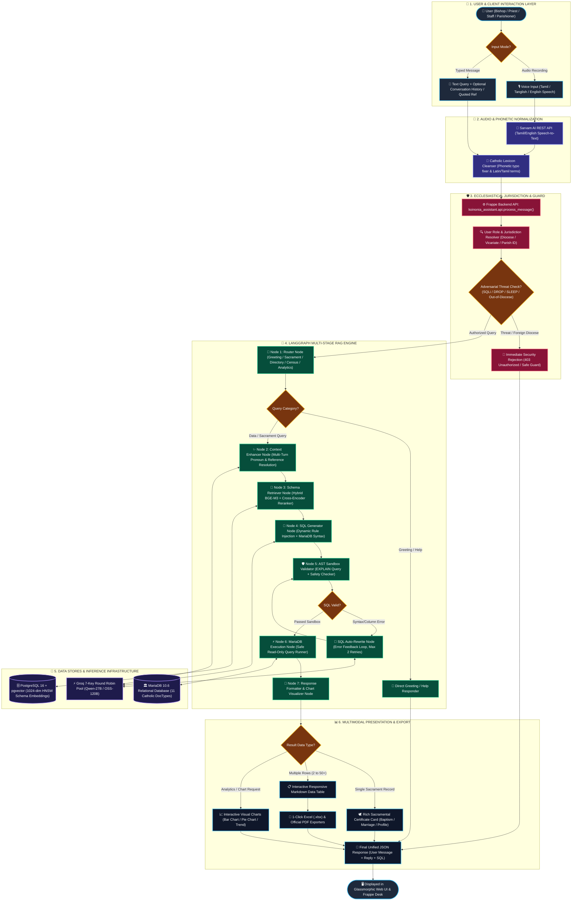
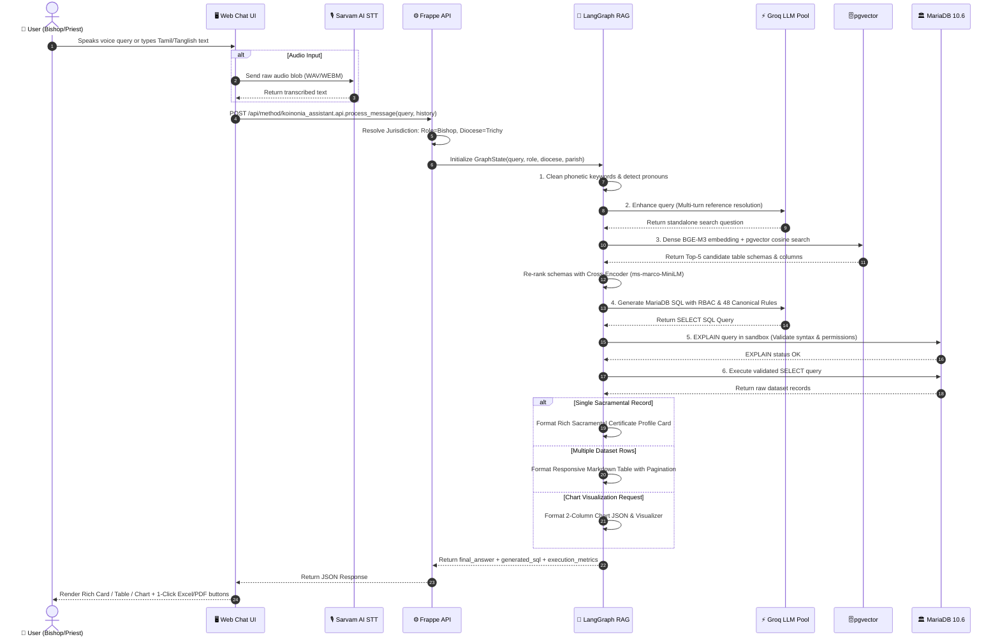
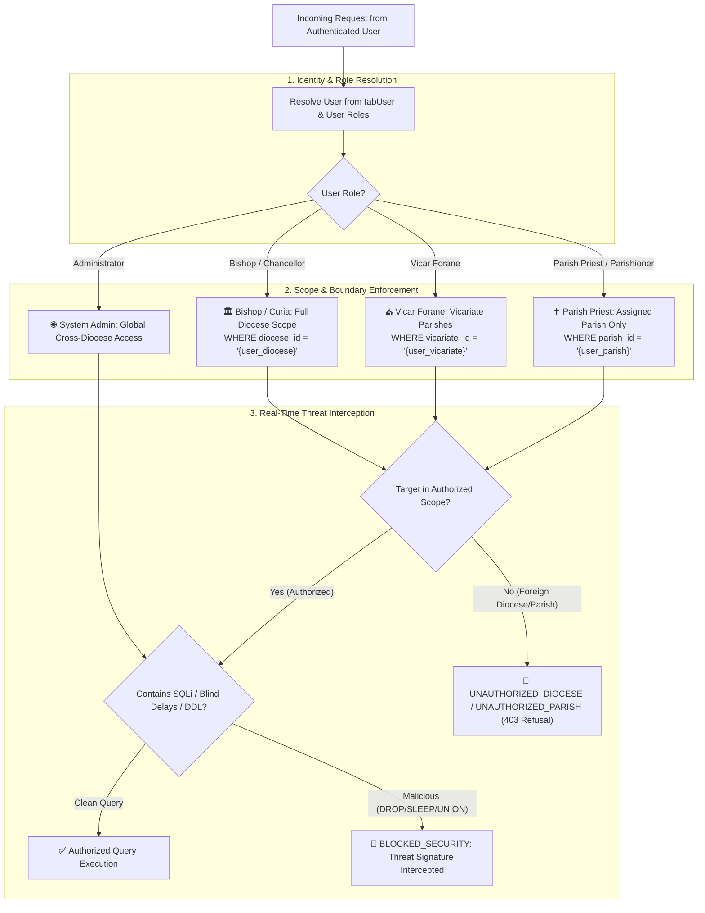
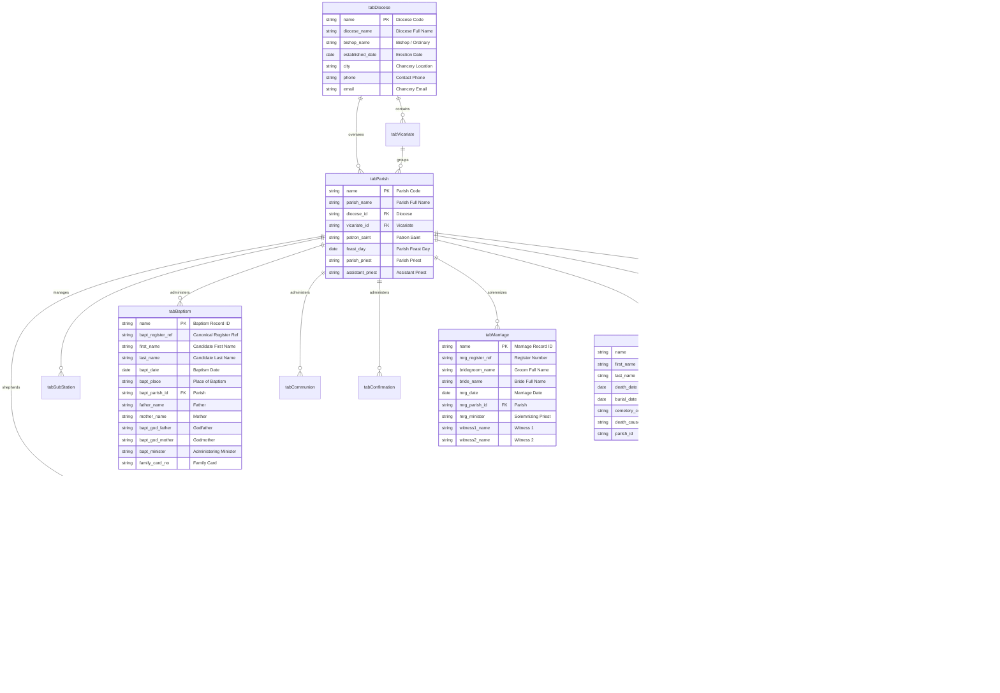
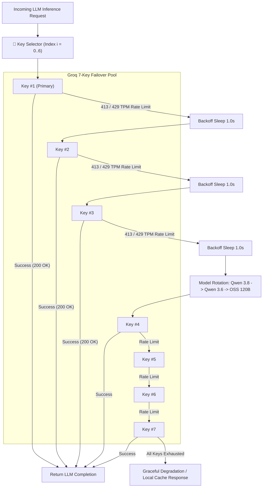
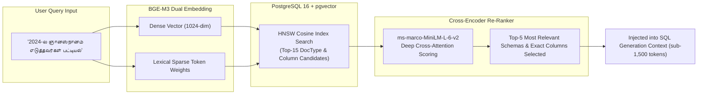
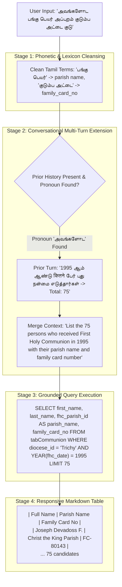

# 📊 KOINONIA Assistant — Complete Mermaid Diagrams Collection (v2.0)

---

## 📑 Table of Contents
1. [🌟 Master End-to-End System Workflow Diagram (Ultra-Clear)](#1-master-end-to-end-system-workflow-diagram)
2. [🔄 Detailed Step-by-Step Sequence Flow Diagram](#2-detailed-step-by-step-sequence-flow-diagram)
3. [🧠 LangGraph 7-Node Autonomous State Machine Flow](#3-langgraph-7-node-autonomous-state-machine-flow)
4. [🛡️ Multi-Tier Ecclesiastical RBAC & Security Guard Architecture](#4-multi-tier-ecclesiastical-rbac--security-guard-architecture)
5. [🗄️ Canonical Entity-Relationship Diagram (11 DocTypes ERD)](#5-canonical-entity-relationship-diagram-11-doctypes-erd)
6. [⚡ Groq Multi-Key Rotator & TPM Rate-Limit Bypass Flow](#6-groq-multi-key-rotator--tpm-rate-limit-bypass-flow)
7. [🔍 Hybrid Vector (BGE-M3) + Cross-Encoder Re-Ranking Pipeline](#7-hybrid-vector-bg-m3--cross-encoder-re-ranking-pipeline)
8. [🌐 Multilingual, Phonetic & Multi-Turn Context Resolution Flow](#8-multilingual-phonetic--multi-turn-context-resolution-flow)

---

## 1. Master End-to-End System Workflow Diagram

---

## 2. Detailed Step-by-Step Sequence Flow Diagram

---

## 3. LangGraph 7-Node Autonomous State Machine Flow

```mermaid
stateDiagram-v2
    [*] --> RouterNode : User Query Received
    
    state RouterNode {
        [*] --> ClassifyIntent
        ClassifyIntent --> DirectAnswer : Greeting / Help / Out of Scope
        ClassifyIntent --> EnhancePipeline : Database Search Required
    }

    DirectAnswer --> FormatResponseNode : Generate Greeting
    EnhancePipeline --> EnhanceQueryNode

    state EnhanceQueryNode {
        [*] --> CheckPronouns
        CheckPronouns --> MergeHistory : Contains 'அவங்களோட' / 'their' / Quoted text
        CheckPronouns --> StandaloneFix : Independent query
        MergeHistory --> StandardizedQuestion
        StandaloneFix --> StandardizedQuestion
    }

    EnhanceQueryNode --> RetrieveContextNode

    state RetrieveContextNode {
        [*] --> GenerateBGEEmbedding
        GenerateBGEEmbedding --> VectorCosineSearch : pgvector HNSW
        VectorCosineSearch --> CrossEncoderRerank : Top-k candidate schemas
        CrossEncoderRerank --> FilteredFewShots
    }

    RetrieveContextNode --> GenerateSQLNode

    state GenerateSQLNode {
        [*] --> SelectPromptTemplate
        SelectPromptTemplate --> ApplyRBACBoundary : Inject diocese_id / parish_id
        ApplyRBACBoundary --> GroqInference : Multi-Key Round Robin
        GroqInference --> RawSQL
    }

    GenerateSQLNode --> ValidateSQLNode

    state ValidateSQLNode {
        [*] --> RegexSanitizer : Sanitize SELECT columns
        RegexSanitizer --> SafetyCheck : Block DROP/INSERT/SLEEP
        SafetyCheck --> MariaDBSandbox : Execute EXPLAIN SQL
    }

    ValidateSQLNode --> ExecuteSQLNode : Validation Succeeded
    ValidateSQLNode --> RewriteSQLNode : Sandbox Error Detected

    state RewriteSQLNode {
        [*] --> AnalyzeDBError
        AnalyzeDBError --> GroqRewrite : Fix column/table name
        GroqRewrite --> RewrittenSQL
    }

    RewriteSQLNode --> ValidateSQLNode : Re-evaluate (Max 2 Retries)
    RewriteSQLNode --> FormatResponseNode : Retries Exhausted (Graceful Fallback)

    state ExecuteSQLNode {
        [*] --> RunReadOnlyQuery
        RunReadOnlyQuery --> FetchDictRows
    }

    ExecuteSQLNode --> FormatResponseNode

    state FormatResponseNode {
        [*] --> CheckRecordCount
        CheckRecordCount --> RenderSacramentCard : Count == 1 & Sacrament Table
        CheckRecordCount --> RenderTable : Count > 1
        CheckRecordCount --> RenderChart : Chart Flag True
    }

    FormatResponseNode --> [*] : Return Final Output to UI
```

---

## 4. Multi-Tier Ecclesiastical RBAC & Security Guard Architecture

---

## 5. Canonical Entity-Relationship Diagram (11 DocTypes ERD)

---

## 6. Groq Multi-Key Rotator & TPM Rate-Limit Bypass Flow

---

## 7. Hybrid Vector (BGE-M3) + Cross-Encoder Re-Ranking Pipeline

---

## 8. Multilingual, Phonetic & Multi-Turn Context Resolution Flow

