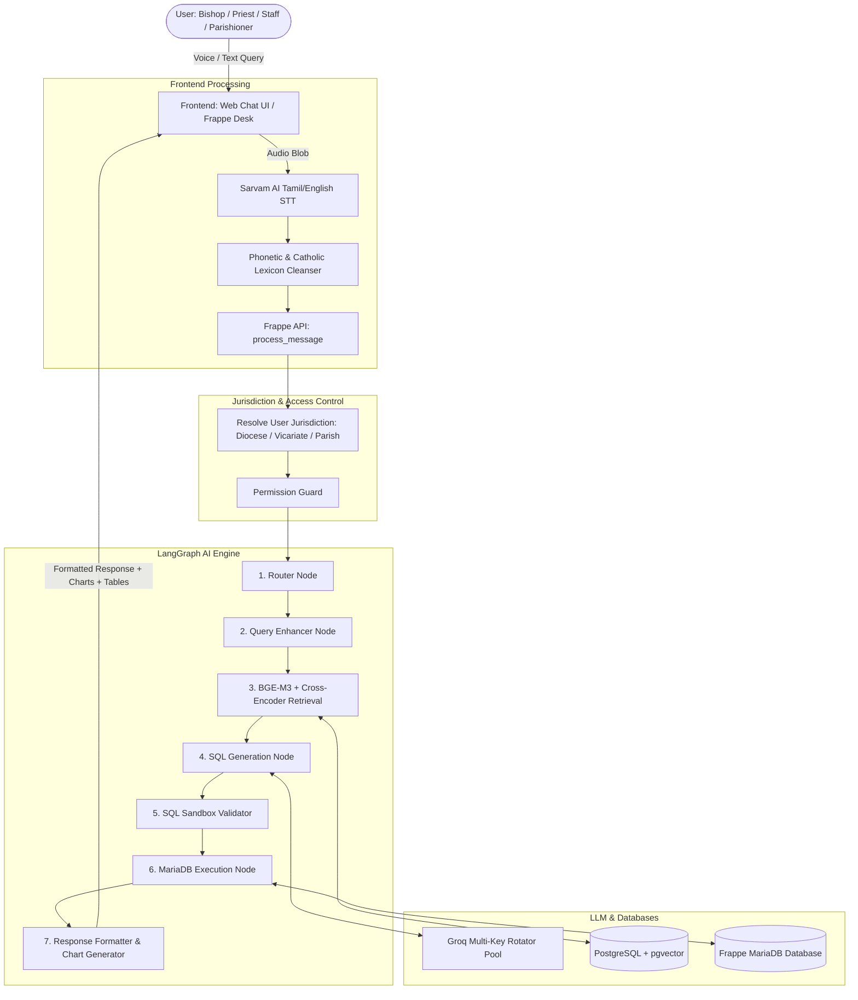
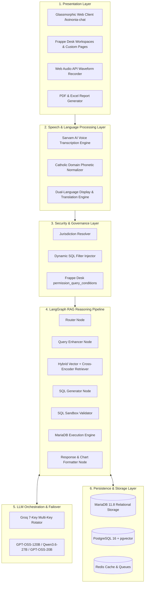
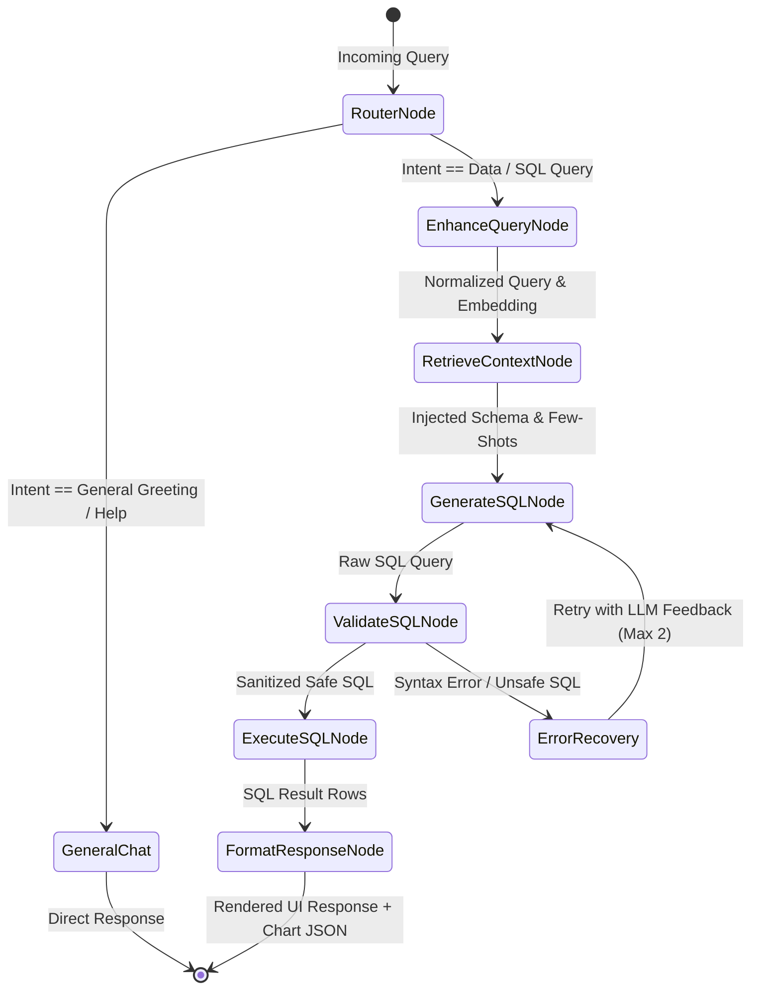
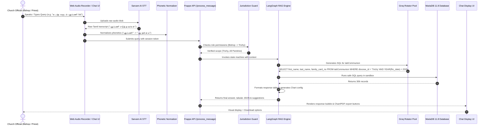
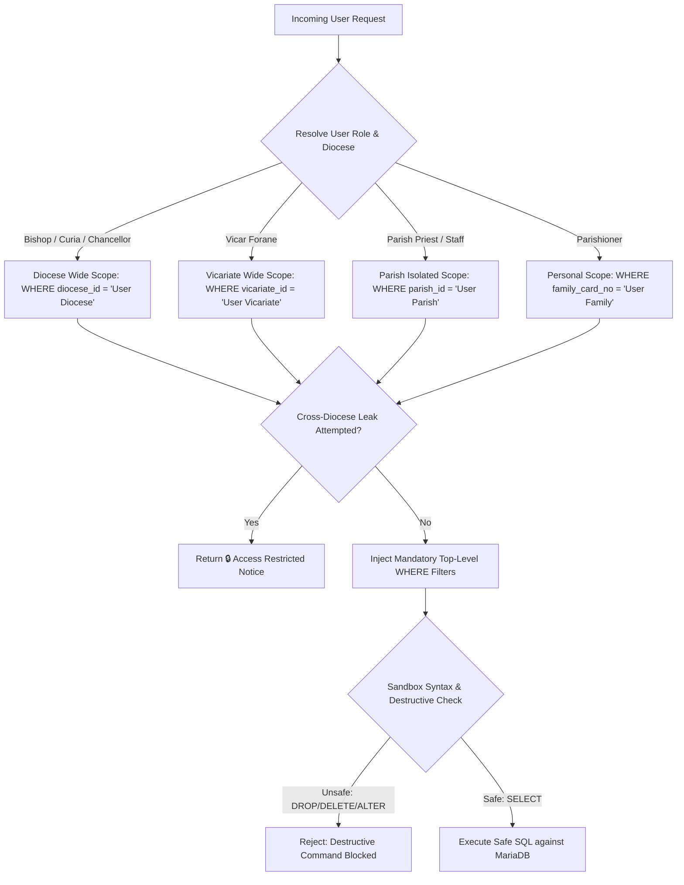
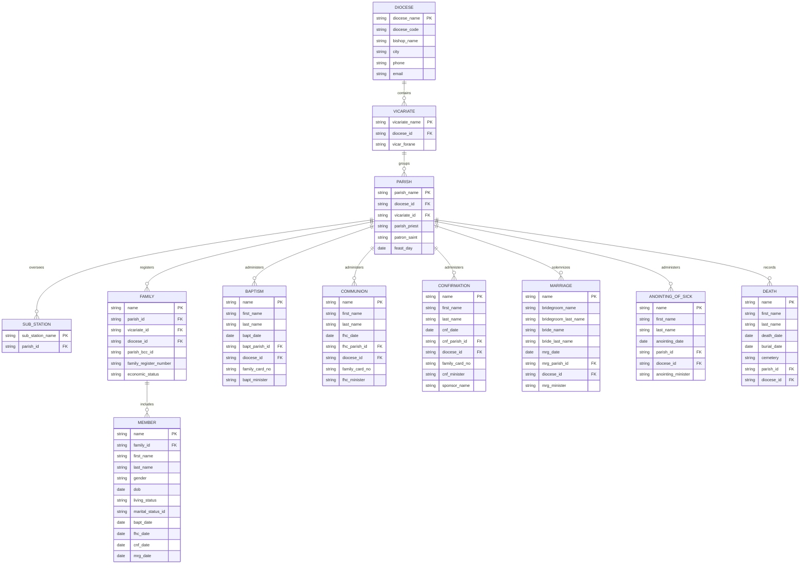
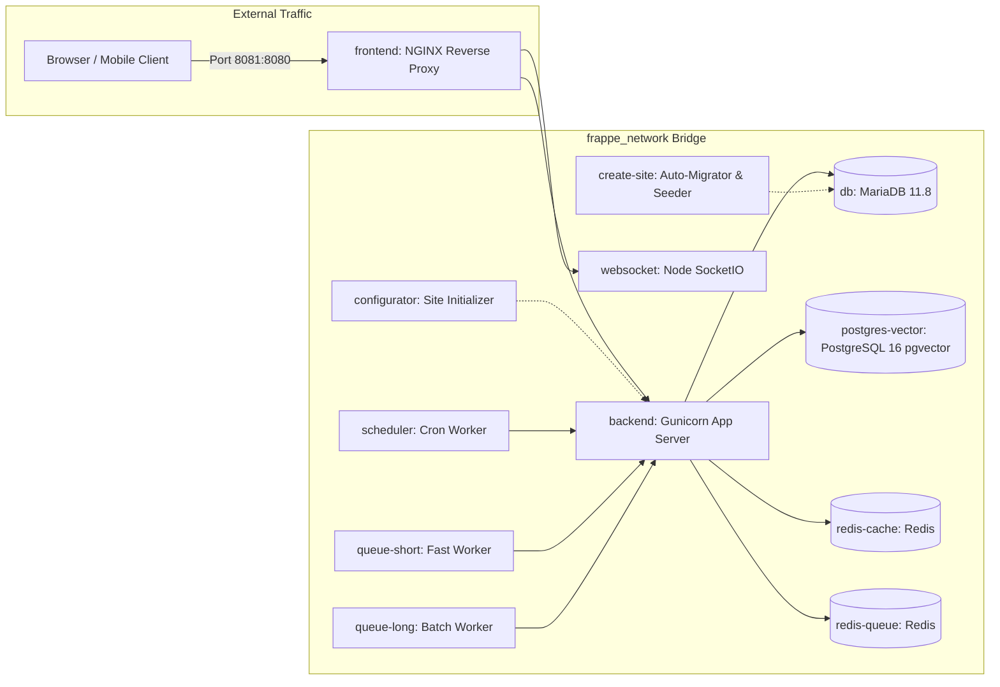
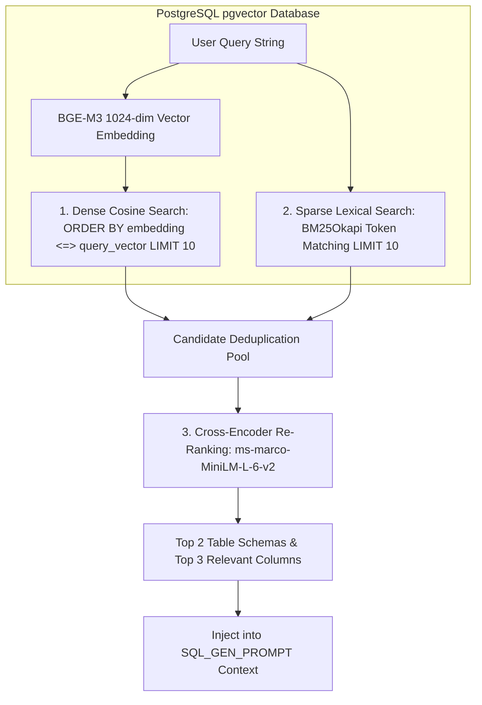
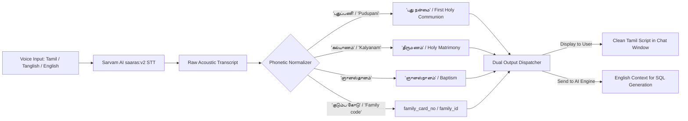

# 📊 KOINONIA Assistant — Complete Mermaid Diagrams Collection

---

## 📑 Table of Contents
1. [Diagram 1: High-Level End-to-End System Architecture](#1-high-level-end-to-end-system-architecture)
2. [Diagram 2: 6-Tier Layered Architecture Model](#2-6-tier-layered-architecture-model)
3. [Diagram 3: LangGraph 7-Node State Machine Pipeline](#3-langgraph-7-node-state-machine-pipeline)
4. [Diagram 4: End-to-End Voice & Text Query Sequence](#4-end-to-end-voice--text-query-sequence)
5. [Diagram 5: Ecclesiastical Jurisdictional Access & Security Guard](#5-ecclesiastical-jurisdictional-access--security-guard)
6. [Diagram 6: Complete Entity-Relationship Diagram (11 DocTypes ERD)](#6-complete-entity-relationship-diagram-11-doctypes-erd)
7. [Diagram 7: Groq Multi-Key Rotator & Rate-Limit Bypass Flow](#7-groq-multi-key-rotator--rate-limit-bypass-flow)
8. [Diagram 8: Docker Microservices Container Network Topology](#8-docker-microservices-container-network-topology)
9. [Diagram 9: Hybrid Vector Search & Cross-Encoder Re-Ranking Pipeline](#9-hybrid-vector-search--cross-encoder-re-ranking-pipeline)
10. [Diagram 10: Multilingual & Phonetic Speech Normalization Flow](#10-multilingual--phonetic-speech-normalization-flow)

---

## 1. High-Level End-to-End System Architecture



---

## 2. 6-Tier Layered Architecture Model



---

## 3. LangGraph 7-Node State Machine Pipeline



---

## 4. End-to-End Voice & Text Query Sequence



---

## 5. Ecclesiastical Jurisdictional Access & Security Guard



---

## 6. Complete Entity-Relationship Diagram (11 DocTypes ERD)



---

## 7. Groq Multi-Key Rotator & Rate-Limit Bypass Flow

```mermaid
flowchart TD
    Start([LLM Invocation Request]) --> SelectKey[Select Active Key: current_key_idx]
    SelectKey --> SendReq[Send Prompt to Primary Model: openai/gpt-oss-120b]
    
    SendReq --> CheckStatus{Response Status}
    CheckStatus -->|200 OK| Success([Return LLM Response])
    
    CheckStatus -->|429 Rate Limit / 413 Token Limit| RotateKey[Increment: current_key_idx = (idx + 1) % len(KEYS)]
    RotateKey --> CheckAttempts{Attempts < Total Keys * 2?}
    
    CheckAttempts -->|Yes| SleepBackoff[Exponential Backoff: sleep(0.5s * attempt)]
    SleepBackoff --> FallbackModel{Attempt > 3?}
    FallbackModel -->|Yes| SwitchFast[Switch to Fallback Model: qwen/qwen3.6-27b]
    FallbackModel -->|No| SelectKey
    SwitchFast --> SelectKey
    
    CheckAttempts -->|No| RaiseError[Raise LLM Pool Exhausted Exception]
```

---

## 8. Docker Microservices Container Network Topology



---

## 9. Hybrid Vector Search & Cross-Encoder Re-Ranking Pipeline



---

## 10. Multilingual & Phonetic Speech Normalization Flow


