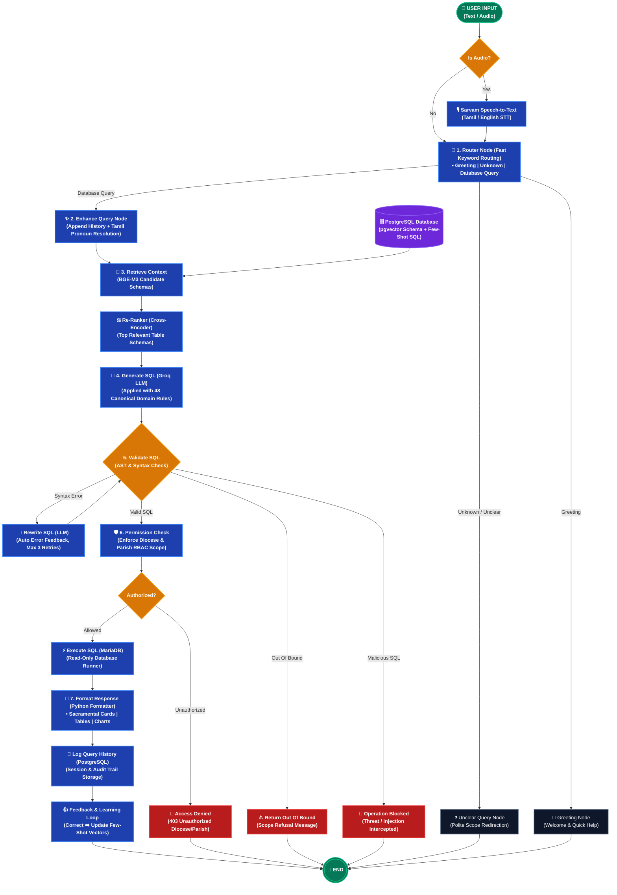

```mermaid
flowchart TD
    %% =========================================================================
    %% ENTERPRISE COLOR PALETTE & STYLING
    %% =========================================================================
    classDef startEnd fill:#047857,stroke:#10B981,stroke-width:2px,color:#FFFFFF,font-weight:bold;
    classDef decision fill:#D97706,stroke:#F59E0B,stroke-width:2px,color:#FFFFFF,font-weight:bold;
    classDef process fill:#1E40AF,stroke:#3B82F6,stroke-width:2px,color:#FFFFFF,font-weight:600;
    classDef database fill:#6D28D9,stroke:#8B5CF6,stroke-width:2px,color:#FFFFFF,font-weight:600;
    classDef blocked fill:#B91C1C,stroke:#EF4444,stroke-width:2px,color:#FFFFFF,font-weight:bold;
    classDef terminal fill:#0F172A,stroke:#64748B,stroke-width:2px,color:#FFFFFF;

    %% =========================================================================
    %% 1. USER INPUT & MODALITY
    %% =========================================================================
    StartNode(["👤 USER INPUT<br/>(Text / Audio)"]):::startEnd
    IsAudio{"Is Audio?"}:::decision
    SarvamSTT["🎙️ Sarvam Speech-to-Text<br/>(Tamil / English STT)"]:::process

    StartNode --> IsAudio
    IsAudio -- "Yes" --> SarvamSTT
    IsAudio -- "No" --> RouterNode
    SarvamSTT --> RouterNode

    %% =========================================================================
    %% 2. INTENT ROUTING
    %% =========================================================================
    RouterNode["📍 1. Router Node (Fast Keyword Routing)<br/>• Greeting | Unknown | Database Query"]:::process

    RouterNode -- "Greeting" --> GreetingNode["💬 Greeting Node<br/>(Welcome & Quick Help)"]:::terminal
    RouterNode -- "Unknown / Unclear" --> UnclearNode["❓ Unclear Query Node<br/>(Polite Scope Redirection)"]:::terminal
    RouterNode -- "Database Query" --> EnhancerNode

    %% =========================================================================
    %% 3. QUERY ENHANCEMENT & SCHEMA RETRIEVAL
    %% =========================================================================
    EnhancerNode["✨ 2. Enhance Query Node<br/>(Append History + Tamil Pronoun Resolution)"]:::process
    PgVectorDB[("🗄️ PostgreSQL Database<br/>(pgvector Schema + Few-Shot SQL)")]:::database
    RetrieverNode["🔎 3. Retrieve Context<br/>(BGE-M3 Candidate Schemas)"]:::process
    RerankerNode["⚖️ Re-Ranker (Cross-Encoder)<br/>(Top Relevant Table Schemas)"]:::process
    SQLGenNode["🤖 4. Generate SQL (Groq LLM)<br/>(Applied with 48 Canonical Domain Rules)"]:::process

    EnhancerNode --> RetrieverNode
    PgVectorDB --> RetrieverNode
    RetrieverNode --> RerankerNode
    RerankerNode --> SQLGenNode

    %% =========================================================================
    %% 4. SQL VALIDATION & ERROR RECOVERY
    %% =========================================================================
    ValidateSQL{"5. Validate SQL<br/>(AST & Syntax Check)"}:::decision
    RewriteSQL["🔄 Rewrite SQL (LLM)<br/>(Auto Error Feedback, Max 3 Retries)"]:::process

    SQLGenNode --> ValidateSQL
    ValidateSQL -- "Syntax Error" --> RewriteSQL
    RewriteSQL --> ValidateSQL
    ValidateSQL -- "Malicious SQL" --> BlockedSecurity["🚫 Operation Blocked<br/>(Threat / Injection Intercepted)"]:::blocked
    ValidateSQL -- "Out Of Bound" --> BlockedOutOfBound["⚠️ Return Out Of Bound<br/>(Scope Refusal Message)"]:::blocked
    ValidateSQL -- "Valid SQL" --> PermissionCheck["🛡️ 6. Permission Check<br/>(Enforce Diocese & Parish RBAC Scope)"]:::process

    %% =========================================================================
    %% 5. AUTHORIZATION & EXECUTION
    %% =========================================================================
    IsAuthorized{"Authorized?"}:::decision
    PermissionCheck --> IsAuthorized
    IsAuthorized -- "Unauthorized" --> AccessDenied["🚫 Access Denied<br/>(403 Unauthorized Diocese/Parish)"]:::blocked
    IsAuthorized -- "Allowed" --> ExecuteSQL["⚡ Execute SQL (MariaDB)<br/>(Read-Only Database Runner)"]:::process

    %% =========================================================================
    %% 6. FORMATTING, LOGGING & FEEDBACK
    %% =========================================================================
    FormatResponse["🎨 7. Format Response (Python Formatter)<br/>• Sacramental Cards | Tables | Charts"]:::process
    LogHistory["📝 Log Query History (PostgreSQL)<br/>(Session & Audit Trail Storage)"]:::process
    FeedbackLoop["👍 Feedback & Learning Loop<br/>(Correct ➡️ Update Few-Shot Vectors)"]:::process

    ExecuteSQL --> FormatResponse
    FormatResponse --> LogHistory
    LogHistory --> FeedbackLoop

    %% =========================================================================
    %% 7. TERMINAL CONVERGENCE
    %% =========================================================================
    EndNode((("🏁 END"))):::startEnd

    FeedbackLoop --> EndNode
    AccessDenied --> EndNode
    BlockedOutOfBound --> EndNode
    BlockedSecurity --> EndNode
    UnclearNode --> EndNode
    GreetingNode --> EndNode
```
