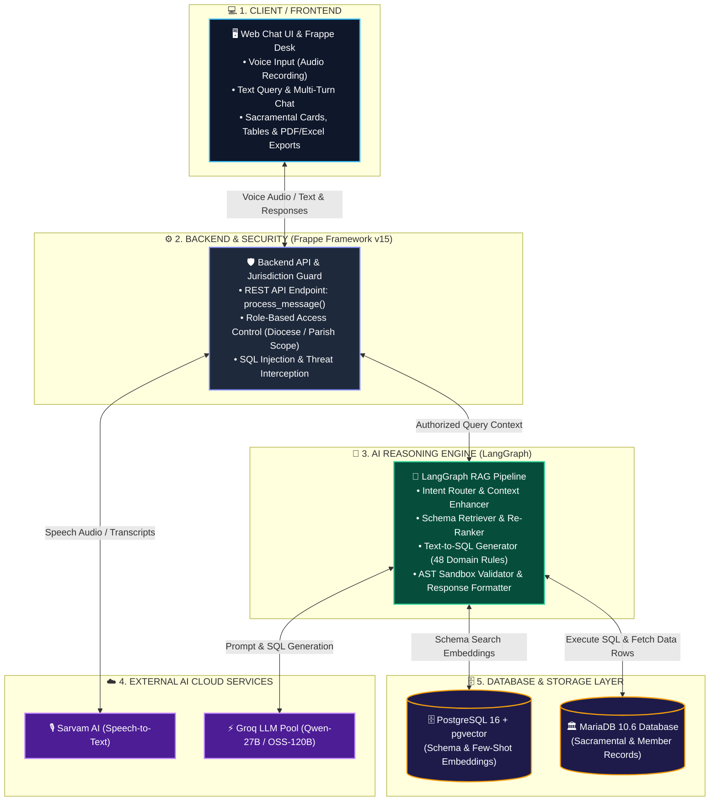

# 🏛️ KOINONIA Assistant — Simplified System Architecture

```mermaid
graph TD
    %% Global Clean Styling
    classDef client fill:#0F172A,stroke:#38BDF8,stroke-width:2px,color:#FFFFFF;
    classDef backend fill:#1E293B,stroke:#818CF8,stroke-width:2px,color:#FFFFFF;
    classDef aiEngine fill:#064E3B,stroke:#34D399,stroke-width:2px,color:#FFFFFF;
    classDef external fill:#4C1D95,stroke:#C084FC,stroke-width:2px,color:#FFFFFF;
    classDef database fill:#1E1B4B,stroke:#F59E0B,stroke-width:2px,color:#FFFFFF;

    %% 1. CLIENT LAYER
    subgraph C1 ["💻 1. CLIENT / FRONTEND"]
        Client["🖥️ Web Chat UI & Frappe Desk<br/>• Voice Input (Audio Recording)<br/>• Text Query & Multi-Turn Chat<br/>• Sacramental Cards, Tables & PDF/Excel Exports"]:::client
    end

    %% 2. BACKEND LAYER
    subgraph C2 ["⚙️ 2. BACKEND & SECURITY (Frappe Framework v15)"]
        Backend["🛡️ Backend API & Jurisdiction Guard<br/>• REST API Endpoint: process_message()<br/>• Role-Based Access Control (Diocese / Parish Scope)<br/>• SQL Injection & Threat Interception"]:::backend
    end

    %% 3. AI ORCHESTRATION LAYER
    subgraph C3 ["🧠 3. AI REASONING ENGINE (LangGraph)"]
        AIEngine["🤖 LangGraph RAG Pipeline<br/>• Intent Router & Context Enhancer<br/>• Schema Retriever & Re-Ranker<br/>• Text-to-SQL Generator (48 Domain Rules)<br/>• AST Sandbox Validator & Response Formatter"]:::aiEngine
    end

    %% 4. EXTERNAL AI CLOUD
    subgraph C4 ["☁️ 4. EXTERNAL AI CLOUD SERVICES"]
        STT["🎙️ Sarvam AI (Speech-to-Text)"]:::external
        LLM["⚡ Groq LLM Pool (Qwen-27B / OSS-120B)"]:::external
    end

    %% 5. PERSISTENCE LAYER
    subgraph C5 ["🗄️ 5. DATABASE & STORAGE LAYER"]
        MariaDB[("🏛️ MariaDB 10.6 Database<br/>(Sacramental & Member Records)")]:::database
        PgVector[("🗄️ PostgreSQL 16 + pgvector<br/>(Schema & Few-Shot Embeddings)")]:::database
    end

    %% Clean Connecting Flows
    Client <-->|Voice Audio / Text & Responses| Backend
    Backend <-->|Speech Audio / Transcripts| STT
    Backend <-->|Authorized Query Context| AIEngine
    AIEngine <-->|Prompt & SQL Generation| LLM
    AIEngine <-->|Schema Search Embeddings| PgVector
    AIEngine <-->|Execute SQL & Fetch Data Rows| MariaDB
```
