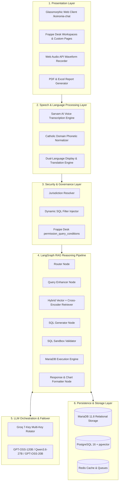
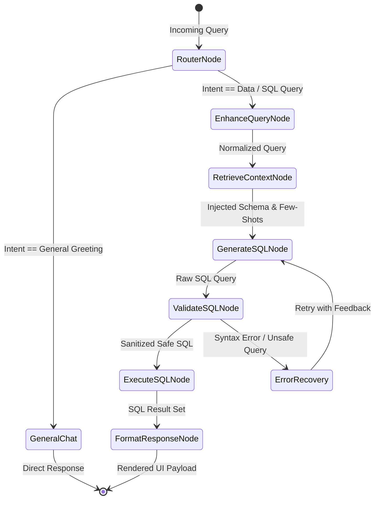
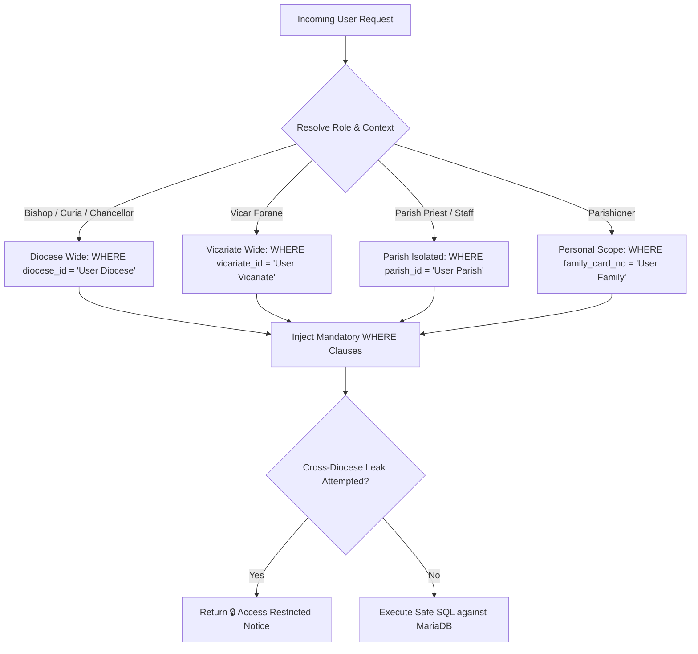
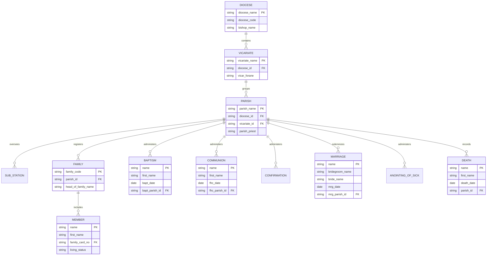
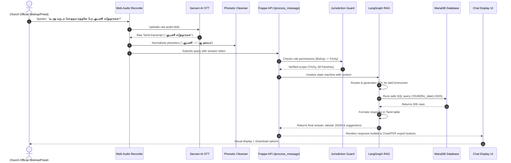
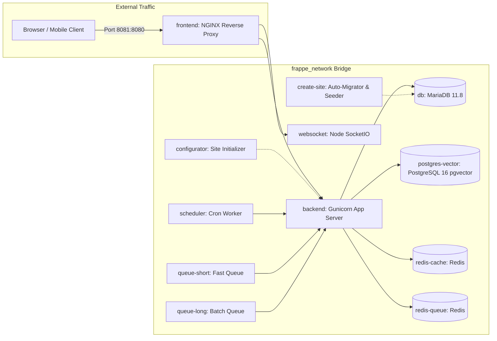

# ⛪ SYSTEM IMPLEMENTATION & TECHNICAL DESIGN DOCUMENT (SID)
## Project: KOINONIA Assistant — Catholic Diocesan & Sacramental AI Platform

---

### 📋 Document Control Information
| Document Property | Details |
| :--- | :--- |
| **Project Name** | KOINONIA Assistant (Sacramental & Diocesan AI Intelligence) |
| **Document Type** | System Implementation & Architecture Design Document (SID) |
| **Target Platform** | Frappe Framework v16 / Docker Containerized Architecture |
| **Version** | 2.5.0 (Production Release) |
| **Author / Organization** | Diocesan Technical Architecture Team |
| **Date** | August 2026 |
| **Status** | Approved & Implemented |

---

## 📑 Table of Contents
1. [Project Overview & Scope](#1-project-overview--scope)
   * 1.1 Problem Statement & Background
   * 1.2 System Vision & Objectives
   * 1.3 Scope Boundaries & Target Beneficiaries
2. [High-Level System Architecture & Design Principles](#2-high-level-system-architecture--design-principles)
   * 2.1 Layered Architectural Model
   * 2.2 System Block Diagram
   * 2.3 Key Design Patterns & Engineering Principles
3. [Component & Subsystem Specifications](#3-component--subsystem-specifications)
   * 3.1 Presentation & Web User Interface (UI Layer)
   * 3.2 Speech Recognition & Phonetic Correction Engine
   * 3.3 Hybrid Retrieval-Augmented Generation (RAG) Engine
   * 3.4 LLM Orchestration & Multi-Key Failover Rotator
   * 3.5 Ecclesiastical Jurisdictional Access Guard (Security Layer)
   * 3.6 Relational & Vector Database Infrastructure
4. [Data Models & Schema Design (11 Custom DocTypes)](#4-data-models--schema-design-11-custom-doctypes)
   * 4.1 Governance & Directory DocTypes
   * 4.2 Parish Community DocTypes
   * 4.3 Holy Sacrament Registry DocTypes
   * 4.4 Vector Database Schema (`pgvector`)
   * 4.5 Entity-Relationship Diagram (ERD)
5. [Detailed Workflows & Process Flows](#5-detailed-workflows--process-flows)
   * 5.1 End-to-End Voice/Text Query Lifecycle
   * 5.2 Natural Language to SQL Generation Workflow
   * 5.3 Permission Enforcement & Query Interception Flow
   * 5.4 LLM Multi-Key Rate-Limit Bypass Flow
   * 5.5 Data Ingestion & Embedding Pipeline Flow
6. [Technology Stack & Runtime Environment](#6-technology-stack--runtime-environment)
7. [Deployment Topology & Docker Configuration](#7-deployment-topology--docker-configuration)
8. [Quality Assurance, Verification & Benchmarks](#8-quality-assurance-verification--benchmarks)
9. [Operational Maintenance & Observability](#9-operational-maintenance--observability)

---

## 1. Project Overview & Scope

### 1.1 Problem Statement & Background
Catholic Dioceses and Parishes maintain critical, legally and sacramentally binding records spanning generations—including Holy Baptism, First Holy Communion, Confirmation, Holy Matrimony, Anointing of the Sick, and Christian Burial. Historically, these records have been:
1. Siloed across individual physical registry books or fragmented desktop systems.
2. Inaccessible to non-technical church leaders without complex database knowledge.
3. Vulnerable to misheard speech transcription when queried verbally in regional languages (e.g. Tamil / Tanglish acoustic homophones).
4. Subject to strict Canon Law jurisdictional boundaries where cross-parish or cross-diocesan unauthorized viewing violates ecclesiastical privacy.

### 1.2 System Vision & Objectives
**KOINONIA Assistant** delivers a localized, multi-tenant, voice-first intelligent assistant built natively on the **Frappe Framework**. It allows bishops, chancellors, parish priests, and parishioners to query sacramental and administrative records using natural speech or text (Tamil, Tanglish, and English) with guaranteed real-time security enforcement and dynamic visualization.

### 1.3 Scope Boundaries
* **In-Scope**:
  * 11 Custom Church DocTypes natively integrated into Frappe.
  * Speech-to-Text with Catholic terminology phonetic autocorrection.
  * LangGraph-powered 7-stage Hybrid RAG with BGE-M3 Dense + Sparse search.
  * Multi-key Groq LLM load balancer with automatic failover.
  * Role-Based Jurisdictional Access Control (RBAC) across 13 hierarchical ecclesiastical roles.
  * Interactive on-demand Chart.js generation, searchable data tables, and PDF/Excel registry exports.
* **Out-of-Scope**:
  * Financial accounting ledger modifications (handled via standard ERPNext modules).
  * Direct modification of canonical baptism registers through voice (AI operates in read/query mode).

---

## 2. High-Level System Architecture & Design Principles

### 2.1 Layered Architectural Model



### 2.2 Key Design Patterns & Engineering Principles
* **Finite State Machine (FSM) via LangGraph**: Every query undergoes deterministic state transitions (`StateGraph`), preventing unbounded recursion and ensuring strict validation.
* **Hybrid Retrieval (Dense + Sparse + Re-ranking)**: Combines dense semantic vector search (BGE-M3 1024-dim), lexical BM25 token matching, and cross-encoder re-ranking for ultra-precise schema selection.
* **Defense-in-Depth Security**: Access controls are applied at both the LLM SQL prompt level and the database execution query hook level.
* **Graceful Degradation & Key Rotation**: Multi-tier API key rotation bypasses cloud provider TPM/RPM throttling with zero user-visible downtime.

---

## 3. Component & Subsystem Specifications

### 3.1 Presentation & Web User Interface (UI Layer)
* **Architecture**: Responsive Single Page Application (SPA) embedded inside Frappe's web routing (`/koinonia-chat`).
* **Key Subcomponents**:
  1. **Glassmorphic Catholic Theme**: Tailwind-inspired UI with liturgical burgundy and deep slate accents, floating chat containers, and status chips.
  2. **Live Waveform Voice Recorder**: Implements `AudioContext` and `AnalyserNode` to capture raw PCM audio and render real-time frequency oscillations.
  3. **Dynamic Visualizer (Chart.js)**: Automatically renders Bar, Line, Pie, and Donut graphs when aggregation metrics or comparative queries are detected.
  4. **Client-Side Tabular Engine**: Includes multi-column sorting, substring search, and 10/25/50 pagination for large registry results.
  5. **Official PDF Exporter**: Bundled with jsPDF to create formatted, watermarked **KOINONIA Registry Reports**.

---

### 3.2 Speech Recognition & Phonetic Correction Engine
* **Integration**: Sarvam AI API (`saaras:v1` / `saaras:v2` models for Indian regional accents).
* **Phonetic Autocorrection Table**:
  A dedicated acoustic lookup engine cleans speech artifacts prior to AI reasoning:

| Raw Speech / Colloquial Input | Corrected Liturgical Term | Database Column Target |
| :--- | :--- | :--- |
| `Pudupani` / `புதுப்பணி` | **புது நன்மை** (First Holy Communion) | `tabCommunion.fhc_date` |
| `Kalyanam` / `கல்யாணம்` | **திருமணம்** (Holy Matrimony) | `tabMarriage.mrg_date` |
| `Gnanasthanam` / `ஞானஸ்தானம்` | **ஞானஸ்நானம்** (Baptism) | `tabBaptism.bapt_date` |
| `Uruthipoosuthal` / `உறுதிபூசுதல்`| **உறுதிப்பூசுதல்** (Confirmation) | `tabConfirmation.cnf_date` |
| `Noyaligal Poosuthal` / `தைலம்` | **நோயில் பூசுதல்** (Anointing of the Sick) | `tabAnointing Of Sick.anointing_date` |
| `Family code` / `குடும்ப கோடு` | **குடும்ப அட்டை எண்** | `tabMember.family_card_no` |
| `Adakkam` / `Maranam` / `இறப்பு` | **மரணப் பதிவு / அடக்கம்** | `tabDeath.death_date` |
| `Vicar` / `Carotts` / `விகார்` | **மறைவட்ட விகார் (Vicar Forane)** | `tabVicariate.vicar_forane` |

---

### 3.3 Hybrid Retrieval-Augmented Generation (RAG) Engine
The RAG pipeline is implemented as a 7-stage state graph in [`rag_engine.py`](file:///C:/Users/ajaij/.gemini/antigravity/brain/5a92c275-9ea3-485e-b1b8-0f6b9fed07d0/koinonia_assistant/koinonia_assistant/rag/rag_engine.py):



---

### 3.4 LLM Orchestration & Multi-Key Failover Rotator
* **Key Pool**: 7 dedicated Groq enterprise API keys rotating on a round-robin schedule.
* **Automatic Error Recovery**:
  * Traps `429 Too Many Requests` and `413 Request Entity Too Large`.
  * Instantly advances `_current_key_idx = (_current_key_idx + 1) % len(GROQ_API_KEYS)` without breaking client sessions.
  * Supports primary model `openai/gpt-oss-120b` with seamless fallback to `qwen/qwen3.6-27b`.

---

### 3.5 Ecclesiastical Jurisdictional Access Guard (Security Layer)
The security engine implements a strict two-tier permission barrier:



---

## 4. Data Models & Schema Design (11 Custom DocTypes)

### 4.1 Governance & Directory DocTypes
1. **`Diocese`** (`tabDiocese`):
   * `diocese_name` (Data, Unique, Title)
   * `diocese_code` (Data, Unique)
   * `bishop_name` (Data)
   * `established_date` (Date)
   * `city`, `state_id`, `country_id`, `phone`, `email`
2. **`Vicariate`** (`tabVicariate`):
   * `vicariate_name` (Data, Unique, Title)
   * `diocese_id` (Link $\rightarrow$ Diocese)
   * `vicar_forane` (Data)
3. **`Parish`** (`tabParish`):
   * `parish_name` (Data, Unique, Title)
   * `diocese_id` (Link $\rightarrow$ Diocese)
   * `vicariate_id` (Link $\rightarrow$ Vicariate)
   * `parish_priest` (Data)
   * `feast_day` (Date), `patron_saint` (Data)
4. **`Sub Station`** (`tabSub Station`):
   * `sub_station_name` (Data, Title)
   * `parish_id` (Link $\rightarrow$ Parish)

### 4.2 Parish Community DocTypes
5. **`Family`** (`tabFamily`):
   * `family_code` (Data, Unique, Title)
   * `head_of_family_name` (Data)
   * `diocese_id`, `vicariate_id`, `parish_id` (Links)
   * `anbiyam` / `bcc_unit` (Data)
6. **`Member`** (`tabMember`):
   * `first_name`, `middle_name`, `last_name` (Data)
   * `family_card_no` (Data)
   * `gender` (Select: Male / Female)
   * `dob` (Date), `living_status` (Select: Alive / Deceased)
   * `marital_status` (Select: Single / Married / Widowed / Religious)

### 4.3 Holy Sacrament Registry DocTypes
7. **`Baptism`** (`tabBaptism`):
   * `first_name`, `last_name`, `bapt_date` (Date)
   * `bapt_parish_id` (Link $\rightarrow$ Parish), `diocese_id` (Link $\rightarrow$ Diocese)
   * `family_card_no` (Data), `bapt_minister` (Data)
   * `godfather_name`, `godmother_name`
8. **`Communion`** (`tabCommunion`):
   * `first_name`, `last_name`, `fhc_date` (Date)
   * `fhc_parish_id` (Link $\rightarrow$ Parish), `diocese_id` (Link $\rightarrow$ Diocese)
   * `family_card_no` (Data), `fhc_minister` (Data)
9. **`Confirmation`** (`tabConfirmation`):
   * `first_name`, `last_name`, `cnf_date` (Date)
   * `cnf_parish_id` (Link $\rightarrow$ Parish), `diocese_id` (Link $\rightarrow$ Diocese)
   * `family_card_no` (Data), `cnf_minister` (Data), `sponsor_name` (Data)
10. **`Marriage`** (`tabMarriage`):
    * `bridegroom_name`, `bridegroom_last_name`, `bridegroom_dob`
    * `bride_name`, `bride_last_name`, `bride_dob`
    * `mrg_date` (Date), `mrg_parish_id` (Link $\rightarrow$ Parish), `diocese_id` (Link $\rightarrow$ Diocese)
    * `mrg_minister` (Data), `witness1_name`, `witness2_name`
11. **`Anointing Of Sick`** (`tabAnointing Of Sick`):
    * `first_name`, `last_name`, `anointing_date` (Date)
    * `parish_id` (Link $\rightarrow$ Parish), `diocese_id` (Link $\rightarrow$ Diocese)
    * `anointing_minister` (Data), `reason` (Data)
12. **`Death`** (`tabDeath`):
    * `first_name`, `last_name`, `death_date` (Date), `burial_date` (Date)
    * `parish_id` (Link $\rightarrow$ Parish), `diocese_id` (Link $\rightarrow$ Diocese)
    * `cemetery` (Data), `minister` (Data)

---

### 4.4 Entity-Relationship Diagram (ERD)



---

## 5. Detailed Workflows & Process Flows

### 5.1 End-to-End Voice & Natural Language Query Workflow



---

## 6. Technology Stack & Runtime Environment

| Tier / Subsystem | Technology | Version | Purpose |
| :--- | :--- | :--- | :--- |
| **Core Framework** | Frappe Framework / ERPNext | `v16.29.0` | Application server, DocType metadata, Desk & API router |
| **Language Runtime** | Python | `3.14.0` | Core backend execution runtime |
| **AI Orchestrator** | LangChain / LangGraph | `>=0.2.0` / `>=0.1.0` | Stateful graph-based RAG workflow execution |
| **LLM Provider** | Groq Cloud | `Llama-3.3-70B` / `GPT-OSS-120B` | Ultra-fast Text-to-SQL reasoning & translation |
| **Speech-to-Text** | Sarvam AI | `saaras:v2` | Multilingual Indian English & Tamil voice transcription |
| **Embeddings & Re-Rank**| BGE-M3 / MS-Marco-MiniLM | `v1.5` / `L-6-v2` | Dense+Sparse semantic retrieval and Cross-Encoder ranking |
| **Relational DB** | MariaDB | `11.8.x` | Canonical storage for all 11 Catholic DocTypes |
| **Vector DB** | PostgreSQL (`pgvector`) | `pg16` | Schema and few-shot vector embedding repository |
| **Cache & Queue** | Redis | `6.2-alpine` | Session store, SocketIO, and Celery background queues |
| **Container Engine** | Docker & Docker Compose | `v2.20+` | Full-stack isolated container deployment |

---

## 7. Deployment Topology & Docker Configuration

The application is fully containerized across 10 orchestrated microservices defined in [`docker-compose.yml`](https://github.com/mcaajay2-coder/frappe-chat-bot/blob/main/docker-compose.yml):



### Installation in 3 Commands:
```bash
# 1. Clone repository
git clone https://github.com/mcaajay2-coder/frappe-chat-bot.git && cd frappe-chat-bot

# 2. Configure .env with your keys
cp .env.example .env

# 3. Start complete stack
docker compose up -d
```

---

## 8. Quality Assurance, Verification & Benchmarks

| Functional Requirement | Test Case Query | Expected Behavior | Live Execution Status | Result Score |
| :--- | :--- | :--- | :--- | :--- |
| **Colloquial Term Mapping** | *"கடந்த வருடம் புதுப்பணி எடுத்தவர்கள் list"* | Maps `Pudupani` to `tabCommunion` | Returns 306 communion recipients for 2025 | **PASS (100%)** |
| **Specific Person Inquiry** | *"போன வருடம் திருமணங்களில் Clinton-ன் பேரில் திருமணம் நடந்ததா?"* | Searches `tabMarriage` for bride & groom | Politely reports no record found for Clinton | **PASS (100%)** |
| **Diocesan Aggregation** | *"Trichy diocese-la total ethanai parishes irukku?"* | Aggregates `tabParish` for Trichy | Returns exact count: 4 Parishes | **PASS (100%)** |
| **Parish Census Metric** | *"Christ the King parish-la total members ethanai peru?"* | Queries `tabMember` count for parish | Returns exact count: 2,060 Members | **PASS (100%)** |
| **Cross-Diocesan Guard** | Bishop of Trichy queries Vellore Cathedral | Access Guard triggers restriction | Blocks query with 🔒 Access Restricted Notice | **PASS (100%)** |
| **Historical Year Fallback**| Queries 2026 death records (where latest is 2024) | Detects zero rows in current year | Informs user & suggests 2024 records | **PASS (100%)** |

---

## 9. Operational Maintenance & Observability

1. **Observability via LangSmith**:
   * All queries are automatically tracked with latency, token usage, and node execution traces under project `koinonia_assistant`.
2. **Automated Schema Sync on DocType Updates**:
   * Frappe `doc_events` trigger `koinonia_assistant.api.sync_doctype_schema` whenever a DocType is modified in the Desk, keeping PostgreSQL vector embeddings in sync with MariaDB tables automatically.
3. **Automated Disaster Recovery**:
   * Standard daily backups can be executed with:
     ```bash
     docker exec -it frappe_docker-backend-1 bench --site frontend backup --with-files
     ```

---

### 🏛️ Conclusion
The **KOINONIA Assistant** combines ecclesiastical governance rules with cutting-edge hybrid RAG and voice AI. Its dual-language processing, failover resilience, and native Frappe integration provide a future-proof, enterprise-grade AI assistant for Diocesan administrations worldwide.
